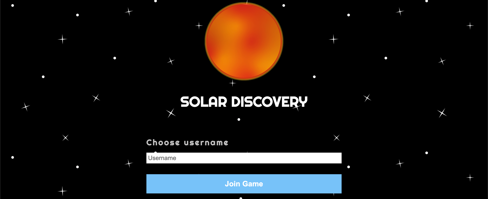
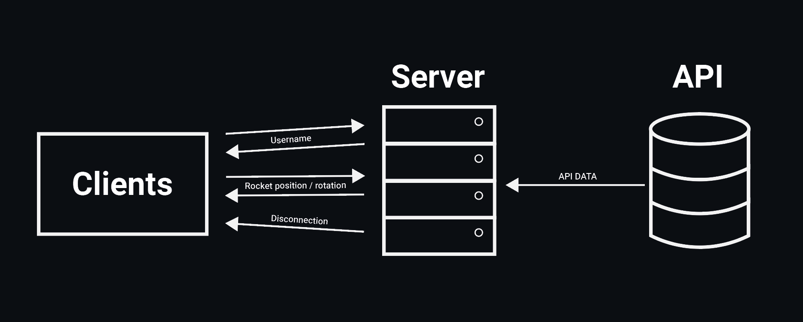

# Solar Discovery

## Table of Contents
- [Concept](#concept)
- [API](#api)
- [Features](#features)
- [Real Time Events](#real-time-events)
- [Data Life Cycle](#data-life-cycle)

## Concept
Isn't space awesome? Well I think it is. That is why I made a multiplayer game where you can fly in space with your own rocket and discover planets. The solar system in this game is a real scale model of our solar system using an API that gives data about every planet and all of there moons.

[https://solar-discovery.herokuapp.com/](https://solar-discovery.herokuapp.com/)

## API
The [L'OpenData du Système Solaire](https://api.le-systeme-solaire.net/en/) is a French API. Luckely they have an English page so I could still understand how to use it. This API can be called using [https://api.le-systeme-solaire.net/rest/bodies/](https://api.le-systeme-solaire.net/rest/bodies/). It is a really simple API.

### Available data
| #  | Name            | Type       | Content                                                                              |
|----|-----------------|------------|--------------------------------------------------------------------------------------|
| 1  | id              | string     | Id of body in the API.                                                               |
| 2  | name            | string     | Body name (in french).                                                               |
| 3  | englishName     | string     | English name.                                                                        |
| 4  | isPlanet        | boolean    | Is it a planet?                                                                      |
| 5  | moons           | array      | Table with all moons.                                                                |
| 6  | semimajorAxis   | integer    | Semimajor Axis of the body in kilometres.                                            |
| 7  | perihelion      | integer    | Perihelion in kilometres.                                                            |
| 8  | aphelion        | integer    | Aphelion in kilometres.                                                              |
| 9  | eccentricity    | decimal    | Orbital eccentricity.                                                                |
| 10 | inclination     | decimal    | Orbital inclination in degrees.                                                      |
| 11 | mass            | object     | Boby mass in 10n kg.                                                                 |
| 12 | vol             | object     | Body volume in 10n km3.                                                              |
| 13 | density         | decimal    | Body density in g.cm3.                                                               |
| 14 | gravity         | decimal    | Surface gravity in m.s-2.                                                            |
| 15 | escape          | decimal    | Escape speed in m.s-1.                                                               |
| 16 | meanRadius      | integer    | Mean radius in kilometres.                                                           |
| 17 | equaRadius      | integer    | Equatorial radius in kilometres.                                                     |
| 18 | polarRadius     | integer    | Polar radius in kilometres.                                                          |
| 19 | escape          | flattening | Flattening.                                                                          |
| 20 | dimension       | string     | Body dimension on the 3 axes X, Y et Z for non-spherical bodies.                     |
| 21 | sideralOrbit    | decimal    | Sideral orbital time for body around another one (the Sun or a planet) in earth day. |
| 22 | sideralRotation | decimal    | Sideral rotation, necessary time to turn around itself, in hour.                     |
| 23 | aroundPlanet    | object     | For a moon, the planet around which it is orbiting.                                  |
| 24 | discoveredBy    | string     | Discovery name.                                                                      |
| 25 | discoveryDate   | string     | Discovery date.                                                                      |
| 26 | alternativeName | string     | Temporary name.                                                                      |
| 27 | axialTilt       | decimal    | Axial tilt.                                                                          |
| 28 | avgTemp         | integer    | Mean temperature in K.                                                               |
| 29 | mainAnomaly     | decimal    | Mean anomaly in degree.                                                              |
| 30 | argPeriapsis    | decimal    | Argument of perihelion in degree.                                                    |
| 31 | longAscNode     | decimal    | Longitude of ascending node in degree.                                               |
| 32 | bodyType        | string     | The body type : Star, Planet, Dwarf Planet, Asteroid, Comet or Moon.                 |

### Used Data
- **englishName** I use the English name of every planet to give every image an `id` for giving every planet the right width and distance from the sun.
- **isPlanet** I use the isPlanet `boolean` to check if every item is a planet so I could filter the moons out of the array.
- **perihelion** I use the perihelion to calculate the distance between every planet and the sun so I could position every planet using `element.style.setProperty('left', ...)`.
- **meanRadius** Used to calculate the size of every planet so I could set every the width using `element.style.setProperty('width', ...)`.
- **sideralOrbit** Used to calculate the speed of every planets rotation around the sun to set the `element.style.setProperty('transform', 'rotate(...deg')`.

*Sadly this API did not include any images at all, but luckely two years ago I remade every planet from our solar system in illustrator. So I placed these images in the images folder and gave the files the name of every **englishName** to create images using the API in ejs like so: `" src="img/planets/<%= asset.englishName %>.svg">`*

## Features

### Current Features
- [x] Create username
- [x] Move rocket by mouse (mouse further from rocket means faster!)
- [x] Toggle movement by pressing `Space`
- [x] Rotate rocket to mouse position
- [x] Coördinates of rocket (top left of screen)
- [x] Planets are positioned using the API for a real scale model of our solar system (using **perihelion**)
- [x] Planets orbit around the sun using `transform: rotate()` (using **sideralOrbit**)
- [x] Pinpoints for every planet so you can always find every planet
- [x] Multiple users can join.
- [x] Updating position and rotation of every rocket to every client

### Future Features
- [x] Updating position of every planet to every client (every client has their own planet rotation. Info needs to be send using sockets) 🌍
- [ ] A chat in the left bottom corner so people can actually talk to each other 😊
- [ ] Changing the "lightspeed" of your rocket so you can travel faster and slower ⚡️
- [ ] Create your own rocket 🚀
- [ ] Fire of rocket only appears when you actually fly 🔥
- [ ] Adding aliens, meteor showers, satellites and maybe the Tesla car in space? 👽 ☄️ 🛰
- [ ] Less consistent stars background ✨
- [ ] Add moons to the planets 🌙

### Bug fixes I want to do
- [x] Pinpoints move kind of buggy (the faster you go, the more they bug) *UPDATE: it is a little bit better now (but still not optimal)*
- [ ] Movement and rotation of other players is lagging
- [x] Sometimes no rocket is shown when joining with username
- [ ] If user is on start menu and a new user joins, the rocket of the new user is in front of form 
- [ ] Just refactoring my code, client side javascript is kind of messy

## Real Time Events

### Connection
When connecting to the server an array of every user online is rendered in ejs. Also the position of every users rocket is sent and kept updated.
```
io.on('connection', function (socket) {
    socket.emit('data', newData);
    socket.on('new user', username => {
        let object = {username: username, id: socket.id};
        userList.push(object);
        io.emit("new user", object);
    })
    socket.on('position', pos => {
        io.emit("position", pos);
    })
    socket.on('disconnect', () => {
        io.emit('user left', {id: socket.id})
        userList = userList.filter(user => user.id !== socket.id );
    })
});
```

### New user
If a user puts in a username and submits the form, the name of the user is sent to the server.
```
userForm.addEventListener('submit', e => {
    if (usernameInput.length > 0) {
        socket.emit('new user', usernameInput);
    }
});
```
The server pushes the username and the socket id of the client into an array and sends the object back to every client.
```
socket.on('new user', username => {
    let object = {username: username, id: socket.id};
    userList.push(object);
    io.emit("new user", object);
})
```

### Disconnect
When a user disconnects from the server the user gets removed from the users array and client side being removed for every client.
```
socket.on('disconnect', () => {
    io.emit('user left', {id: socket.id})
    userList = userList.filter(user => user.id !== socket.id );
})

socket.on('user left', user => {
    document.querySelector(`#${user.id}`).remove()
});
```

## Data Life Cycle




> _Fun fact: the port used for this site is the year in which the first person ever went into space!_
